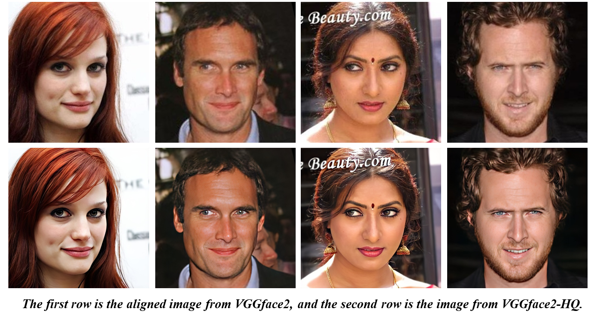
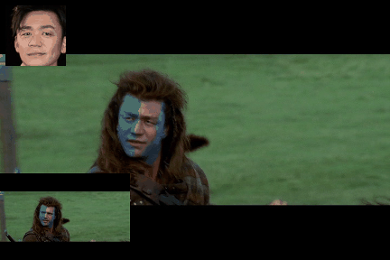

# SimSwap: An Efficient Framework For High Fidelity Face Swapping
## Proceedings of the 28th ACM International Conference on Multimedia
**The official repository with Pytorch**

**Our method can realize **arbitrary face swapping** on images and videos with **one single trained model**.**

Training and test code are now available!
[ <a href="https://colab.research.google.com/github/neuralchen/SimSwap/blob/main/train.ipynb"></a>](https://colab.research.google.com/github/neuralchen/SimSwap/blob/main/train.ipynb)

We are working with our incoming paper SimSwap++, keeping expecting!

The high resolution version of ***SimSwap-HQ*** is supported!

[](https://github.com/neuralchen/SimSwap)

Our paper can be downloaded from [[Arxiv]](https://arxiv.org/pdf/2106.06340v1.pdf) [[ACM DOI]](https://dl.acm.org/doi/10.1145/3394171.3413630)


### This project also received support from [SocialBook](https://socialbook.io).
<!-- [](https://socialbook.io) -->


<!-- [[Google Drive]](https://drive.google.com/file/d/1fcfWOGt1mkBo7F0gXVKitf8GJMAXQxZD/view?usp=sharing) 
[[Baidu Drive ]](https://pan.baidu.com/s/1-TKFuycRNUKut8hn4IimvA) Password: ```ummt``` -->

## Attention
***This project is for technical and academic use only. Please do not apply it to illegal and unethical scenarios.***

***In the event of violation of the legal and ethical requirements of the user's country or region, this code repository is exempt from liability***

***Please do not ignore the content at the end of this README!***

If you find this project useful, please star it. It is the greatest appreciation of our work.

## Top News 

**`2023-09-26`**: We fixed bugs in colab!

**`2023-04-25`**: We fixed the "AttributeError: 'SGD' object has no attribute 'defaults' now" bug. If you have already downloaded **arcface_checkpoint.tar**, please **download it again**. Also, you also need to update the scripts in ```./models/```.

**`2022-04-21`**: For resource limited users, we provide the cropped VGGFace2-224 dataset [[Google Driver] VGGFace2-224 (10.8G)](https://drive.google.com/file/d/19pWvdEHS-CEG6tW3PdxdtZ5QEymVjImc/view?usp=sharing) [[Baidu Driver]](https://pan.baidu.com/s/1OiwLJHVBSYB4AY2vEcfN0A) [Password: lrod].

**`2022-04-20`**: Training scripts are now available. We highly recommend that you guys train the simswap model with our released high quality dataset [VGGFace2-HQ](https://github.com/NNNNAI/VGGFace2-HQ).

**`2021-11-24`**: We have trained a beta version of ***SimSwap-HQ*** on [VGGFace2-HQ](https://github.com/NNNNAI/VGGFace2-HQ) and open sourced the checkpoint of this model (if you think the Simswap 512 is cool, please star our  [VGGFace2-HQ](https://github.com/NNNNAI/VGGFace2-HQ) repo). Please don’t forget to go to [Preparation](./docs/guidance/preparation.md) and [Inference for image or video face swapping](./docs/guidance/usage.md) to check the latest set up.

**`2021-11-23`**: The google drive link of [VGGFace2-HQ](https://github.com/NNNNAI/VGGFace2-HQ) is released. 

**`2021-11-17`**: We released a high resolution face dataset [VGGFace2-HQ](https://github.com/NNNNAI/VGGFace2-HQ) and the method to generate this dataset. This dataset is for research purpose. 

**`2021-08-30`**: Docker has been supported, please refer [here](https://replicate.ai/neuralchen/simswap-image) for details.

**`2021-08-17`**: We have updated the [Preparation](./docs/guidance/preparation.md), The main change is that the gpu version of onnx is now installed by default, Now the time to process a video is greatly reduced.

**`2021-07-19`**: ***Obvious border abruptness has been resolved***. We add the ability to using mask and upgrade the old algorithm for better visual effect, please go to [Inference for image or video face swapping](./docs/guidance/usage.md) for details. Please don’t forget to go to [Preparation](./docs/guidance/preparation.md) to check the latest set up. (Thanks for the help from [@woctezuma](https://github.com/woctezuma) and [@instant-high](https://github.com/instant-high))

## The first open source high resolution dataset for face swapping!!!
## High Resolution Dataset [VGGFace2-HQ](https://github.com/NNNNAI/VGGFace2-HQ)

[](https://github.com/NNNNAI/VGGFace2-HQ)


## Dependencies
- python3.6+
- pytorch1.5+
- torchvision
- opencv
- pillow
- numpy
- imageio
- moviepy
- insightface
- ***timm==0.5.4***

## Training

[Preparation](./docs/guidance/preparation.md)

The training script is slightly different from the original version, e.g., we replace the patch discriminator with the projected discriminator, which saves a lot of hardware overhead and achieves slightly better results.

In order to ensure the normal training, the batch size must be greater than 1.

Friendly reminder, due to the difference in training settings, the user-trained model will have subtle differences in visual effects from the pre-trained model we provide.

- Train 224 models with VGGFace2 224*224 [[Google Driver] VGGFace2-224 (10.8G)](https://drive.google.com/file/d/19pWvdEHS-CEG6tW3PdxdtZ5QEymVjImc/view?usp=sharing) [[Baidu Driver] ](https://pan.baidu.com/s/1OiwLJHVBSYB4AY2vEcfN0A) [Password: lrod]

For faster convergence and better results, a large batch size (more than 16) is recommended!

***We recommend training more than 400K iterations (batch size is 16), 600K~800K will be better, more iterations will not be recommended.***


```
python train.py --name simswap224_test --batchSize 8  --gpu_ids 0 --dataset /path/to/VGGFace2HQ --Gdeep False
```

[Colab demo for training 224 model][ <a href="https://colab.research.google.com/github/neuralchen/SimSwap/blob/main/train.ipynb"></a>](https://colab.research.google.com/github/neuralchen/SimSwap/blob/main/train.ipynb)

For faster convergence and better results, a large batch size (more than 16) is recommended!

- Train 512 models with VGGFace2-HQ 512*512 [VGGFace2-HQ](https://github.com/NNNNAI/VGGFace2-HQ).
```
python train.py --name simswap512_test  --batchSize 16  --gpu_ids 0 --dataset /path/to/VGGFace2HQ --Gdeep True
```


## Inference with a pretrained SimSwap model
[Preparation](./docs/guidance/preparation.md)

[Inference for image or video face swapping](./docs/guidance/usage.md)

[Colab demo](https://colab.research.google.com/github/neuralchen/SimSwap/blob/main/SimSwap%20colab.ipynb)

<div style="background: yellow; width:140px; font-weight:bold;font-family: sans-serif;">Stronger feature</div>

[Colab for switching specific faces in multi-face videos][ <a href="https://colab.research.google.com/github/neuralchen/SimSwap/blob/main/MultiSpecific.ipynb"></a>](https://colab.research.google.com/github/neuralchen/SimSwap/blob/main/MultiSpecific.ipynb)

[Image face swapping demo & Docker image on Replicate](https://replicate.ai/neuralchen/simswap-image)


## Video

<div>


</div>
<div>


</div>

## Results


<!-- 


 -->


**High-quality videos can be found in the link below:**

[[Mama(video) 1080p]](https://drive.google.com/file/d/1mnSlwzz7f4H2O7UwApAHo64mgK4xSNyK/view?usp=sharing)

[[Google Drive link for video 1]](https://drive.google.com/file/d/1hdne7Gw39d34zt3w1NYV3Ln5cT8PfCNm/view?usp=sharing)

[[Google Drive link for video 2]](https://drive.google.com/file/d/1bDEg_pVeFYLnf9QLSMuG8bsjbRPk0X5_/view?usp=sharing)

[[Google Drive link for video 3]](https://drive.google.com/file/d/1oftHAnLmgFis4XURcHTccGSWbWSXYKK1/view?usp=sharing)

[[Baidu Drive link for video]](https://pan.baidu.com/s/1WTS6jm2TY17bYJurw57LUg ) Password: ```b26n```

[[Online Video]](https://www.bilibili.com/video/BV12v411p7j5/)

## User case
If you have some interesting results after using our project and are willing to share, you can contact us by email or share directly on the issue. Later, we may make a separate section to show these results, which should be cool.

At the same time, if you have suggestions for our project, please feel free to ask questions in the issue, or contact us directly via email: [email1](mailto:chenxuanhongzju@outlook.com), [email2](mailto:nicklau26@foxmail.com), [email3](mailto:ziangliu824@gmail.com). (All three can be contacted, just choose any one)

## License
For academic and non-commercial use only.The whole project is under the CC-BY-NC 4.0 license. See [LICENSE](https://github.com/neuralchen/SimSwap/blob/main/LICENSE) for additional details.


## To cite our papers
```
@inproceedings{DBLP:conf/mm/ChenCNG20,
  author    = {Renwang Chen and
               Xuanhong Chen and
               Bingbing Ni and
               Yanhao Ge},
  title     = {SimSwap: An Efficient Framework For High Fidelity Face Swapping},
  booktitle = {{MM} '20: The 28th {ACM} International Conference on Multimedia},
  year      = {2020}
}
```
```
@Article{simswapplusplus,
    author  = {Xuanhong Chen and
              Bingbing Ni and
              Yutian Liu and
              Naiyuan Liu and
              Zhilin Zeng and
              Hang Wang},
    title   = {SimSwap++: Towards Faster and High-Quality Identity Swapping},
    journal = {{IEEE} Trans. Pattern Anal. Mach. Intell.},
    volume  = {46},
    number  = {1},
    pages   = {576--592},
    year    = {2024}
}
```

## Related Projects

**Please visit our another ACMMM2020 high-quality style transfer project**

[](https://github.com/neuralchen/ASMAGAN)

[](https://github.com/neuralchen/ASMAGAN)

**Please visit our AAAI2021 sketch based rendering project**

[](https://github.com/TZYSJTU/Sketch-Generation-with-Drawing-Process-Guided-by-Vector-Flow-and-Grayscale)
[](https://github.com/TZYSJTU/Sketch-Generation-with-Drawing-Process-Guided-by-Vector-Flow-and-Grayscale)

**Please visit our high resolution face dataset VGGFace2-HQ**

[](https://github.com/NNNNAI/VGGFace2-HQ)

Learn about our other projects 

[[VGGFace2-HQ]](https://github.com/NNNNAI/VGGFace2-HQ);

[[RainNet]](https://neuralchen.github.io/RainNet);

[[Sketch Generation]](https://github.com/TZYSJTU/Sketch-Generation-with-Drawing-Process-Guided-by-Vector-Flow-and-Grayscale);

[[CooGAN]](https://github.com/neuralchen/CooGAN);

[[Knowledge Style Transfer]](https://github.com/AceSix/Knowledge_Transfer);

[[SimSwap]](https://github.com/neuralchen/SimSwap);

[[ASMA-GAN]](https://github.com/neuralchen/ASMAGAN);

[[SNGAN-Projection-pytorch]](https://github.com/neuralchen/SNGAN_Projection)

[[Pretrained_VGG19]](https://github.com/neuralchen/Pretrained_VGG19).

## Acknowledgements

<!--ts-->
* [Deepfacelab](https://github.com/iperov/DeepFaceLab)
* [Insightface](https://github.com/deepinsight/insightface)
* [Face-parsing.PyTorch](https://github.com/zllrunning/face-parsing.PyTorch)
* [BiSeNet](https://github.com/CoinCheung/BiSeNet)
<!--te-->
