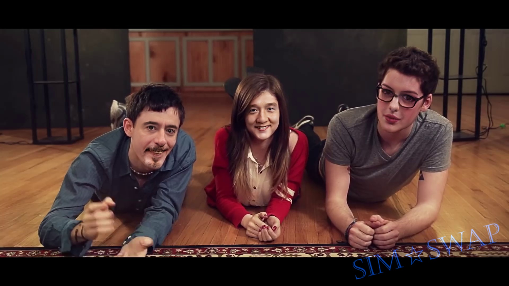

<!--
 * @FilePath: \SimSwap\docs\guidance\usage.md
 * @Author: AceSix
 * @Date: 2021-06-28 10:01:40
 * @LastEditors: AceSix
 * @LastEditTime: 2021-06-28 10:05:11
 * Copyright (C) 2021 SJTU. All rights reserved.
-->

# Usage

###### Before running, please make sure you have installed the environment and downloaded requested files according to the [preparation guidance](./preparation.md).
###### The below example command lines are using mask by default.

### Simple face swapping for already face-aligned images
```
python test_one_image.py --name people --Arc_path arcface_model/arcface_checkpoint.tar --pic_a_path crop_224/6.jpg --pic_b_path crop_224/ds.jpg --output_path output/ 
```

### Face swapping for video

- Swap only one face within the video(the one with highest confidence by face detection).
```
python test_video_swapsingle.py --crop_size 224 --use_mask --name people --Arc_path arcface_model/arcface_checkpoint.tar --pic_a_path ./demo_file/Iron_man.jpg --video_path ./demo_file/multi_people_1080p.mp4 --output_path ./output/multi_test_swapsingle.mp4 --temp_path ./temp_results 
```
- Swap all faces within the video.
```
python test_video_swapmulti.py --crop_size 224 --use_mask --name people --Arc_path arcface_model/arcface_checkpoint.tar --pic_a_path ./demo_file/Iron_man.jpg --video_path ./demo_file/multi_people_1080p.mp4 --output_path ./output/multi_test_swapmulti.mp4 --temp_path ./temp_results 
```
- Swap the ***specific*** face within the video.
```
python test_video_swapspecific.py --crop_size 224 --use_mask --pic_specific_path ./demo_file/specific1.png --name people --Arc_path arcface_model/arcface_checkpoint.tar --pic_a_path ./demo_file/Iron_man.jpg --video_path ./demo_file/multi_people_1080p.mp4 --output_path ./output/multi_test_specific.mp4 --temp_path ./temp_results 
```
When changing the specified face, you need to give a picture of the person whose face is to be changed. Then assign the picture path to the argument "***--pic_specific_path***". This picture should be a front face and show the entire head and neck, which can help accurately change the face (if you still don’t know how to choose the picture, you can refer to the specific*.png of [./demo_file/](https://github.com/neuralchen/SimSwap/tree/main/demo_file)). It would be better if this picture was taken from the video to be changed.

- Swap ***multi specific*** face with **multi specific id** within the video.
```
python test_video_swap_multispecific.py --crop_size 224 --use_mask  --name people --Arc_path arcface_model/arcface_checkpoint.tar --video_path ./demo_file/multi_people_1080p.mp4 --output_path ./output/multi_test_multispecific.mp4 --temp_path ./temp_results --multisepcific_dir ./demo_file/multispecific 
```
The folder you assign to ***"--multisepcific_dir"*** should be looked like:
```
$Your folder name$

├── DST_01.jpg(png)
└── DST_02.jpg(png)
└──...
└── SRC_01.jpg(png)
└── SRC_02.jpg(png)
└──...
```
The result is that the face corresponding to SRC_01.jpg (png) in the video will be replaced by the face corresponding to DST_01.jpg (png). Then the character corresponding to SRC_02.jpg(png) will be replaced by the face of DST_02.jpg(png), and so on. Note that when using your own data and naming it, do not remove the **0** in SRC_(DST_)**0**1.jpg(png), etc.


### Face swapping for Arbitrary images

- Swap only one face within one image(the one with highest confidence by face detection). The result would be saved to ./output/result_whole_swapsingle.jpg
```
python test_wholeimage_swapsingle.py --crop_size 224 --use_mask  --name people --Arc_path arcface_model/arcface_checkpoint.tar --pic_a_path ./demo_file/Iron_man.jpg --pic_b_path ./demo_file/multi_people.jpg --output_path ./output/ 
```
- Swap all faces within one image. The result would be saved to ./output/result_whole_swapmulti.jpg
```
python test_wholeimage_swapmulti.py --crop_size 224 --use_mask  --name people --Arc_path arcface_model/arcface_checkpoint.tar --pic_a_path ./demo_file/Iron_man.jpg --pic_b_path ./demo_file/multi_people.jpg --output_path ./output/ 
```
- Swap **specific** face within one image. The result would be saved to ./output/result_whole_swapspecific.jpg
```
python test_wholeimage_swapspecific.py --crop_size 224 --use_mask  --name people --Arc_path arcface_model/arcface_checkpoint.tar --pic_a_path ./demo_file/Iron_man.jpg --pic_b_path ./demo_file/multi_people.jpg --output_path ./output/ --pic_specific_path ./demo_file/specific2.png 
```
- Swap **multi specific** face with **multi specific id** within one image. The result would be saved to ./output/result_whole_swap_multispecific.jpg
```
python test_wholeimage_swap_multispecific.py --crop_size 224 --use_mask  --name people --Arc_path arcface_model/arcface_checkpoint.tar --pic_b_path ./demo_file/multi_people.jpg --output_path ./output/ --multisepcific_dir ./demo_file/multispecific 
```
### About using Simswap 512 (beta version)
We trained a beta version of Simswap 512 on [VGGFace2-HQ](https://github.com/NNNNAI/VGGFace2-HQ) and open sourced the model (if you think the Simswap 512 is cool, please star our  [VGGFace2-HQ](https://github.com/NNNNAI/VGGFace2-HQ) repo).

The usage of applying Simswap 512 is to modify the value of the argument: "***--crop_size***" to 512 , take the command line of "Swap **multi specific** face with **multi specific id** within one image." as an example, the following command line can get the result without watermark:
```
python test_wholeimage_swap_multispecific.py --crop_size 512 --use_mask  --name people --Arc_path arcface_model/arcface_checkpoint.tar --pic_b_path ./demo_file/multi_people.jpg --output_path ./output/ --multisepcific_dir ./demo_file/multispecific 
```
The effect of Simswap 512 is shown below.


### About watermark of simswap logo
The above example command lines are to add the simswap logo as the watermark by default. After our discussion, we have added a hyper parameter to control whether to remove watermark.

The usage of removing the watermark is to add an argument: "***--no_simswaplogo***" to the command line, take the command line of "Swap all faces within one image" as an example, the following command line can get the result without watermark:
```
python test_wholeimage_swapmulti.py --no_simswaplogo  --crop_size 224 --use_mask  --name people --Arc_path arcface_model/arcface_checkpoint.tar --pic_a_path ./demo_file/Iron_man.jpg --pic_b_path ./demo_file/multi_people.jpg --output_path ./output/
```
### About using mask for better result
We provide two methods to paste the face back to the original image after changing the face: Using mask or using bounding box. At present, the effect of using mask is the best. All the above code examples are using mask. If you want to use the bounding box, you only need to remove the --use_mask in the code example.
Difference between using mask and not using mask can be found [here](https://imgsli.com/NjE3OTA).

### Difference between single face swapping and all face swapping are shown below.


### Parameters
|  Parameters   | Function  |
|  :----  | :----  |
| --name  | The SimSwap training logs name |
| --pic_a_path  | Path of image with the target face |
| --pic_b_path  | Path of image with the source face to swap |
| --pic_specific_path  | Path of image with the specific face to be swapped |
|--multisepcific_dir  |Path of image folder for multi specific face swapping|
| --video_path  | Path of video with the source face to swap |
| --temp_path  | Path to store intermediate files  |
| --output_path  | Path of directory to store the face swapping result  |
| --no_simswaplogo  |The hyper parameter to control whether to remove watermark |
| --use_mask  |The hyper parameter to control whether to use face parsing for the better visual effects(I recommend to use)|

### Note
We expect users to have GPU with at least 3G memory.the For those who do not, we will provide Colab Notebook implementation in the future.
